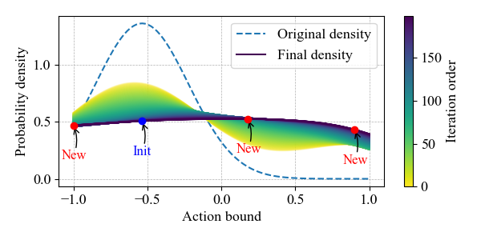
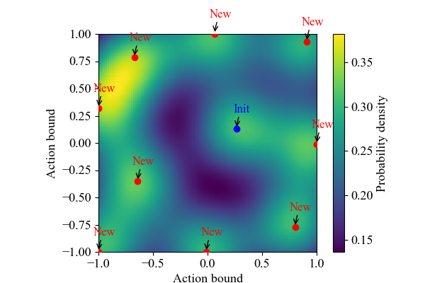

# Sampling based on Gaussian kernel density estimation

## requirements

pytorch

## Characteristic

Supports calculation of Gaussian kernel density estimation of any dimensional data, allowing samples to have gradients, so that the calculated entropy also has gradients.

Implemented entirely in torch, allowing for GPU acceleration, as kernel density estimation for high-dimensional data takes some time.

## Functional

`guassian_kde.py` is an implementation that supports high-dimensional Gaussian kernel density estimation.

`demo.ipynb` gives some demonstrations, including cases of one-dimensional and two-dimensional data, and visualization. The demo also provides a **sampling implementation**, which implements the following function: for some data samples, new sample points are sampled, and the newly added sample points maximize the entropy of the kernel density estimate of the data, that is, the kernel density function is close to a uniform distribution under extreme conditions. The calculation of entropy is based on the trapezoidal approximation method, which is also implemented in torch. Since the Gaussian kernel density estimation method can retain the gradient, gradient descent is used for optimization here.

## Visualization

For 1d data:

1 initd data and 3 sampling data. The addition of new sampling points results in a more uniform kernel density (maximum entropy as much as possible)

For 2d data:

## Improvement requirements

There may be some computational inefficiencies in the current implementation, and you can propose contributions.
